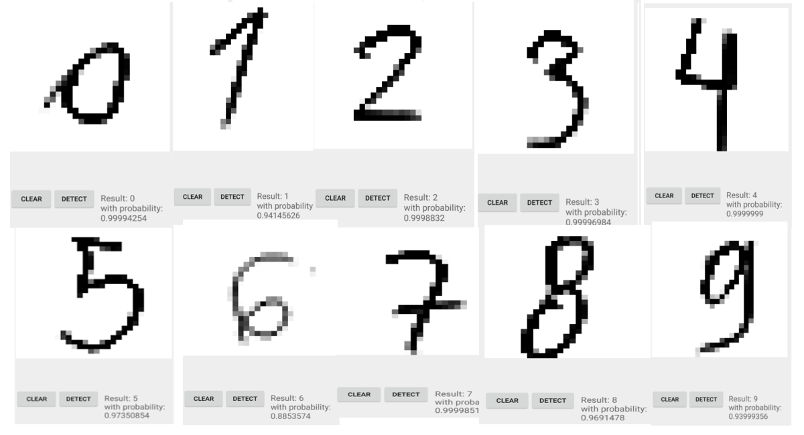

# MNIST on Android with TensorFlow

Check the video demo [here](https://www.youtube.com/watch?v=gahi0Hjgokw)

Beautiful edition, I know.  

Handwritten digits classification from MNIST on Android with TensorFlow.  

If you want to make your own version of this app or want to know
how to save your model and export it for Android or other devices check the
very simple tutorial bellow.  

The UI and expert-graph.pb model were taken from: https://github.com/miyosuda/TensorFlowAndroidMNIST, so thank you miyousuda.  
The TensorFlow jar and so armeabi-v7a were taken from: https://github.com/MindorksOpenSource/AndroidTensorFlowMNISTExample,
so thank you MindorksOpenSource.  
The Tensorflow so of x86 was taken from: https://github.com/cesardelgadof/TensorFlowAndroidMNIST, so thank you cesardelgadof.  

If you have no ideia what I just said above, have a look on the instructions bellow.

## How to run this?

Just open this project with Android Studio and is ready to run, this will work
with x86 and armeabi-v7a architectures.

## How to export my model?

A full example can be seen [here](https://github.com/mari-linhares/mnist-android-tensorflow/blob/master/tensorflow_model/convnet.py)

1. Train your model
2. Keep an in memory copy of eveything your model learned (like biases and weights)
   Example: `_w = sess.eval(w)`, where w was learned from training.
3. Rewrite your model changing the variables for constants with value = in memory copy of learned variables.
   Example: `w_save = tf.constant(_w)`  
   
   Also make sure to put names in the input and output of the model, this will be needed for the model later.
   Example:  
   `x = tf.placeholder(tf.float32, [None, 1000], name='input')`  
   `y = tf.nn.softmax(tf.matmul(x, w_save) + b_save), name='output')`  
4. Export your model with:  
   `tf.train.write_graph(<graph>, <path for the exported model>, <name of the model>.pb, as_text=False)`

## How to run my model with Android?

You need two things:

1. [The TensorFlow jar](https://github.com/MindorksOpenSource/AndroidTensorFlowMNISTExample/blob/master/app/libs/libandroid_tensorflow_inference_java.jar)  
   Move it to the libs folder, right click and add as library.  

2. The TensorFlow so file for the desired architecture:  
[x86](https://github.com/cesardelgadof/TensorFlowAndroidMNIST/blob/master/app/src/main/jniLibs/x86/libtensorflow_mnist.so)  
[armeabi-v7a](https://github.com/MindorksOpenSource/AndroidTensorFlowMNISTExample/tree/master/app/src/main/jniLibs/armeabi-v7a)  

Creat the jniLibs/x86 folder or the jniLibs/armeabi-v7a folder at the main folder.  
Move it to app/src/main/jniLibs/x86/libtensorflow_inference.so or app/src/jniLibs/armeabi-v7a/libtensorflow_inference.so

If you want to generate these files yourself, [here](https://blog.mindorks.com/android-tensorflow-machine-learning-example-ff0e9b2654cc) is a nice tutorial of how to do it.

## Interacting with TensorFlow

To interact with TensorFlow you will need an instance of TensorFlowInferenceInterface, you can see more details about it [here](https://github.com/mari-linhares/mnist-android-tensorflow/blob/master/MnistAndroid/app/src/main/java/mariannelinhares/mnistandroid/Classifier.java)

Thank you, have fun!

